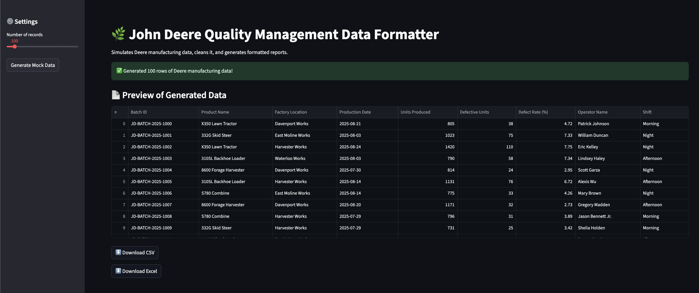

# 🌿 John Deere Quality Management Data Formatter

A **public demo** inspired by internal tools at **John Deere**.  
This app simulates manufacturing output data, **formats it into clean reports**,  
and makes it easy to **analyze quality metrics**—just like real production systems.

🔗 **Live Demo**: [https://jennys-quality-data-formatter.streamlit.app/](https://jennys-quality-data-formatter.streamlit.app/)

---

## 📌 Project Overview

At John Deere, quality metrics are critical to ensuring production excellence.  
To demonstrate my work, I created this **public demo** that replicates Deere’s internal reporting tools.

This app:
- Generates **mock Deere manufacturing data** 🏭  
- Cleans & formats data for **CSV and Excel reports**  
- Highlights **defect rates** for quick quality insights  
- Lets users **download polished reports**  
- *(Optional)* Ready for integration with SQL databases

---

## 🚀 Features

| **Feature**              | **Description**                                  |
|--------------------------|--------------------------------------------------|
| 🛠 Mock Data Generator    | Create realistic Deere-style production batch data |
| 🧹 Automated Formatter    | Cleans, sorts, and recalculates defect rates     |
| 📄 Downloadable Reports   | Export clean data as **CSV** or **Excel**        |
| 📊 Excel Styling          | Professional Deere-branded header formatting     |
| 🌎 Public Access          | Hosted via **Streamlit Cloud** for easy sharing  |

---

## 🖼️ Preview

|  |

| Data Table | Excel Report |
|------------|--------------|
|  |  |

---

## 🛠 Tech Stack

- **Python** – Core logic and automation  
- **Pandas** – Data cleaning & processing  
- **Faker** – Generates Deere-style mock data  
- **Streamlit** – Web app UI for the demo  
- **XlsxWriter** – Beautiful Excel formatting  
- _(Optional)_ SQL Server / PostgreSQL support

---

## ⚡ Quick Start

```bash
git clone https://github.com/<your-username>/quality-data-formatter.git
cd quality-data-formatter

python3 -m venv venv
source venv/bin/activate      # Mac/Linux
# or
venv\Scripts\activate         # Windows

pip install -r requirements.txt
streamlit run scripts/app.py
```

---

## 📊 Use Case

> You’re a Deere plant manager reviewing quality metrics:
> - Select 200 batch records
> - Generate and download clean CSV/Excel reports
> - Instantly see defect patterns by product and factory

---

## 🌐 Deployment

This app is hosted on **Streamlit Cloud**, auto-updated from GitHub with every push.

---

## 🧩 Future Enhancements

- Add SQL database integration  
- Build historical dashboards with charts  
- Enable user data uploads  
- Automate daily report emails

---

## 👤 Author

**Jenny Le**   
[LinkedIn](https://www.linkedin.com/in/jenny-le0421/) | [Email] (jenny.le0421@gmail.com)

---

## 📄 License / Disclaimer

This is a **public demo** using **simulated data only**—no proprietary Deere systems or data are exposed.
